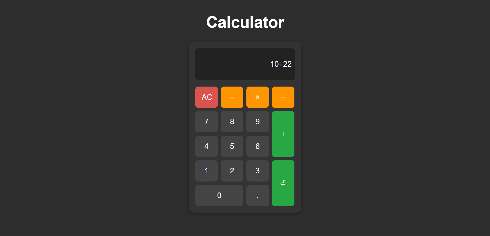

# Calculator Web App

## Overview
This is a simple web-based calculator built using HTML, CSS, and JavaScript. It allows users to perform basic arithmetic operations such as addition, subtraction, multiplication, and division.

## Features
- User-friendly interface with a grid layout for buttons
- Supports numbers, decimal points, and basic operators
- "AC" button to clear the display
- "Enter" button to compute the result
- Responsive design with hover effects

## Technologies Used
- HTML for structure
- CSS for styling and layout
- JavaScript for functionality

## Installation & Usage
1. Clone or download the repository.
2. Open the `index.html` file in a web browser.
3. Use the buttons to input numbers and operators.
4. Press "Enter" or click the green button to get the result.
5. Click "AC" to reset the calculator.

## File Structure
- `index.html` - The main HTML file for the calculator.
- `style.css` - The stylesheet for styling the calculator.
- `script.js` - The JavaScript file handling calculator logic.

## Future Improvements
- Implement keyboard support.
- Add more advanced functions (e.g., square root, exponentiation).
- Improve UI with animations and themes.